+++
title = 'Restoring a Gaggia Classic espresso machine'
date = 2024-12-01T13:00:00+01:00
tags = ['espresso', 'restoration']
draft = false
+++

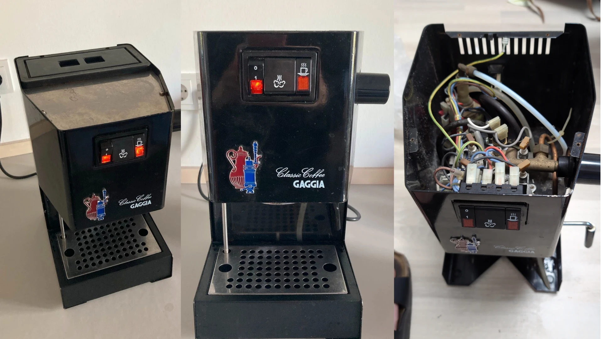

I bought an old Gaggia Classic espresso machine for cheap. The previous owner claimed that the pressure was off sometimes and that there was some rust on the frame.
What caught my attention when looking at the pictures from the offering was the fact that the labels on the switches were in pretty good shape. Either the switches got replaced at some point or the machine hasn't seen much use.

The price was 82€ shipping included.

## Opening the Gaggia for the first time

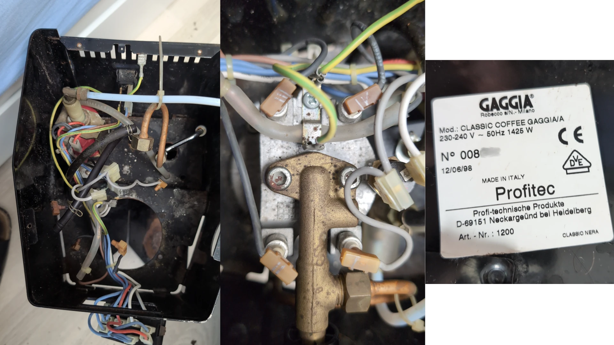

The seller did not lie when mentioning rust, in fact there was quite a lot of it visible on the surface but also hidden underneath the paint. When people service their Gaggia Classic machines at home, one common practice is to label the connectors with numbers. Nobody has done it for this machine which either means it hasn't been serviced at all or the maintenance was done professionally without requiring labels.

I continued disassembling the machine and inspected each component individually. Separating the brew group and boiler turned out to be quite challenging since the screws were quite corroded; In fact when trying to do so I managed to rip off all of the four screw heads. Eventually the boiler could be inspected which turned out to be in a terrible state and is beyond repair. At least I could try to save the rest of the brew group by removing what's left of the screws.

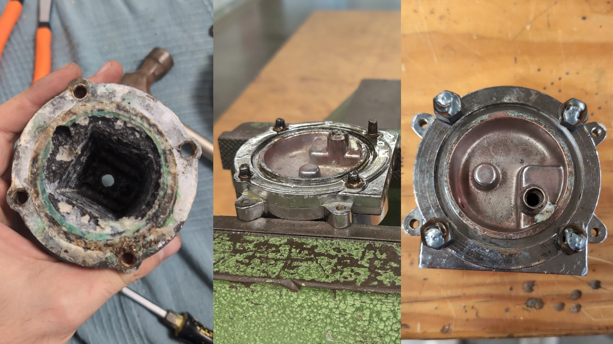

This plan went through after successfully turning out the screws with the help of a welded nut and some penetrating oil. The brew group was ready for the ultrasonic cleaner and some citric acid.

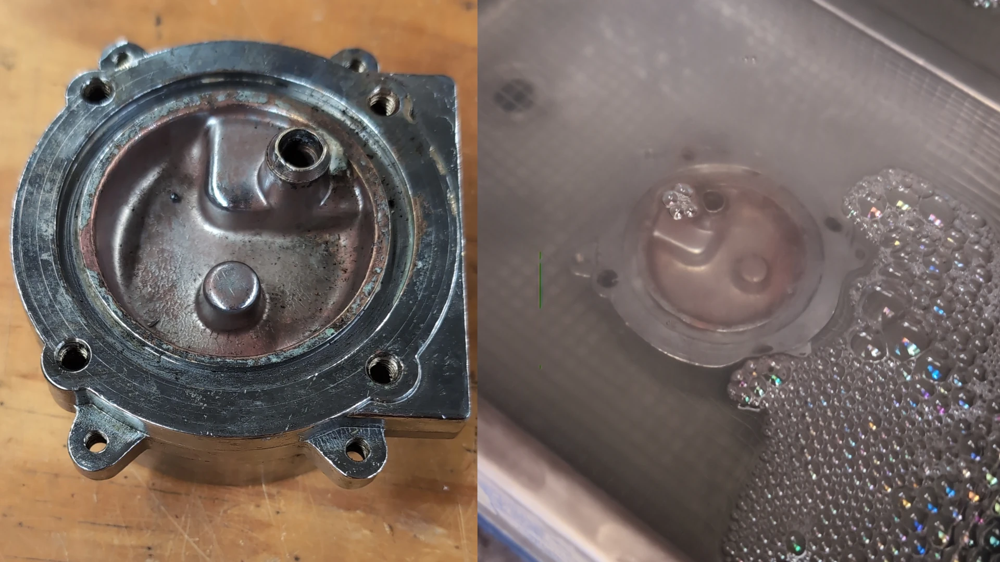

## Repainting the Frame
The next step was to remove all the rust from the case/frame. I decided to use the sandblasting machine for that purpose. This took quite a few hours but the result was worth it.

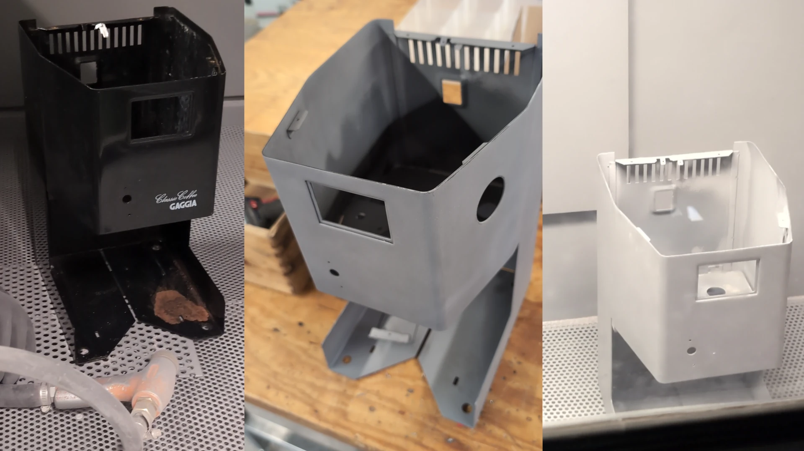

After applying the powder, it went in the oven for 20 minutes and looked brand new in it's new color. Some edged in the inside of the frame were not covered by the powder.

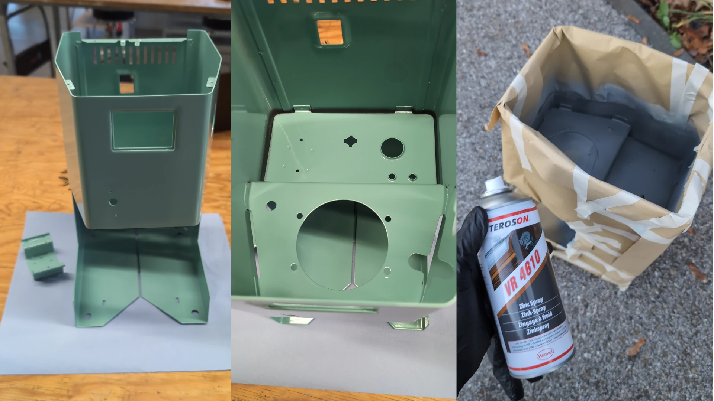

Since these also were the spots where rust showed up before the restoration, I decided to apply some sealing zinc spray and seal up the crucial areas.

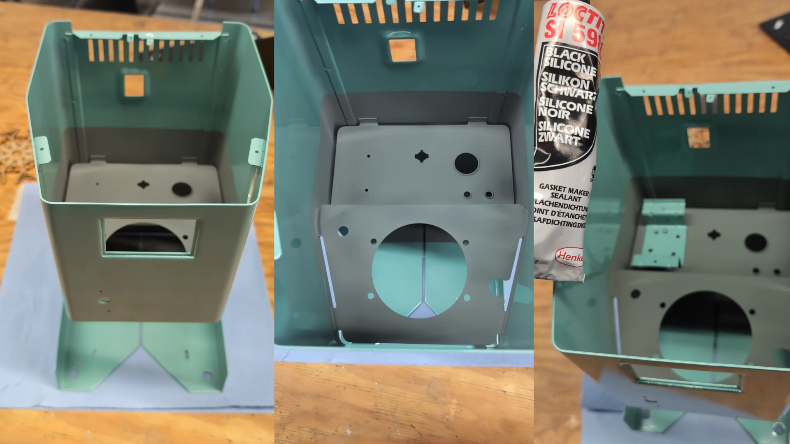

The mount for the pump was separated from the frame before by drilling up the welding spots. This way it could be powder coated separately and reattached with rivets and some black silicone. Hopefully this will avoid rust to settle in the future.

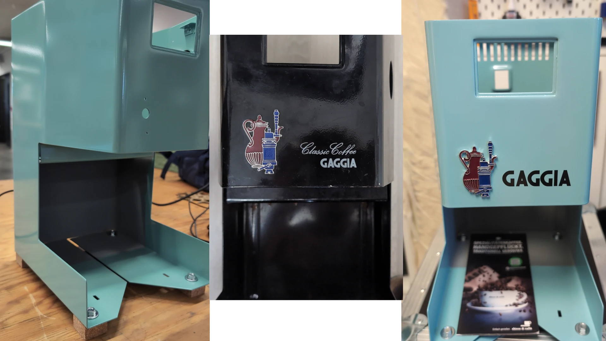

After reattaching the emblem and a freshly plotted version of the Gaggia logo, the machine shows what it could look like after the restoration.

Next, the assembly and wiring was to be done, starting with preperation of the boiler surface and attachting it to the brew group. 

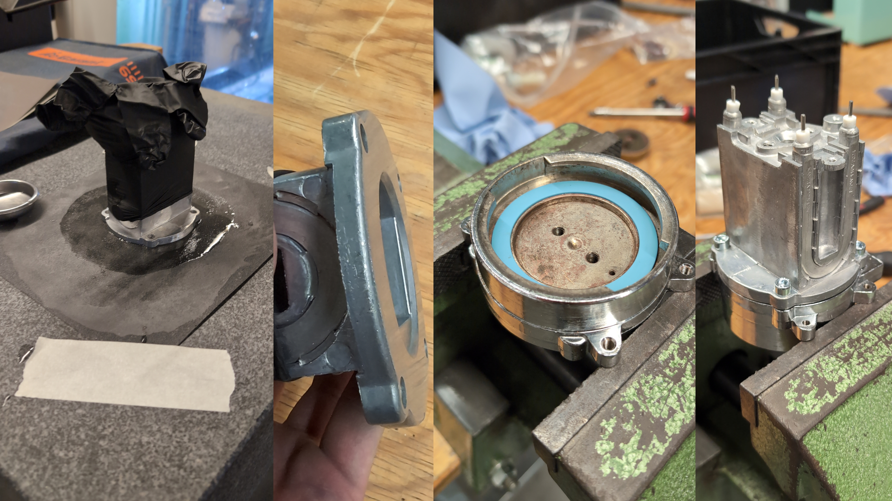

After that, I continued with the wiring and general assembly. This took quite a while, especially the verification of the electrical connections.

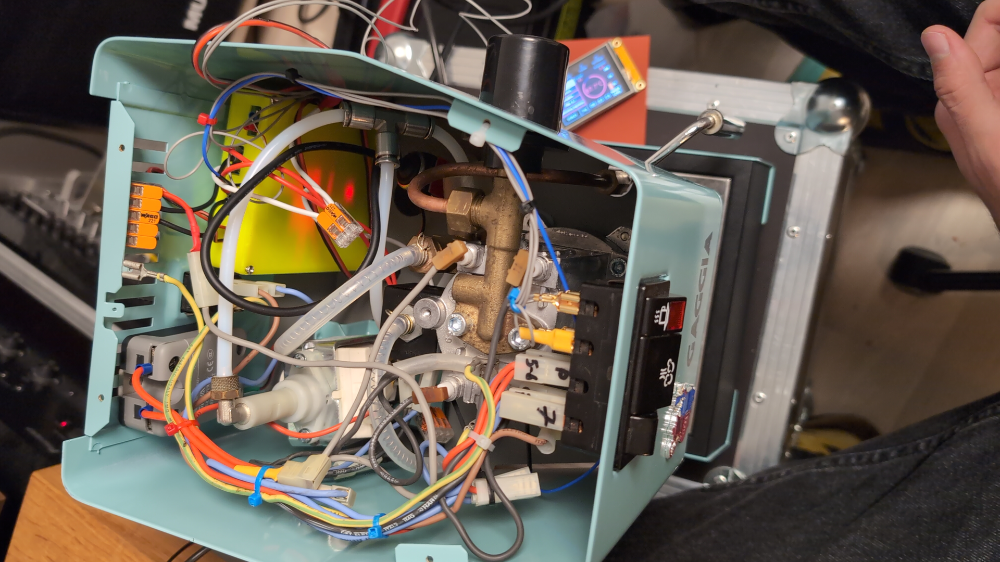

All that effort was worth it! Here's how my coffee area looks in the end:

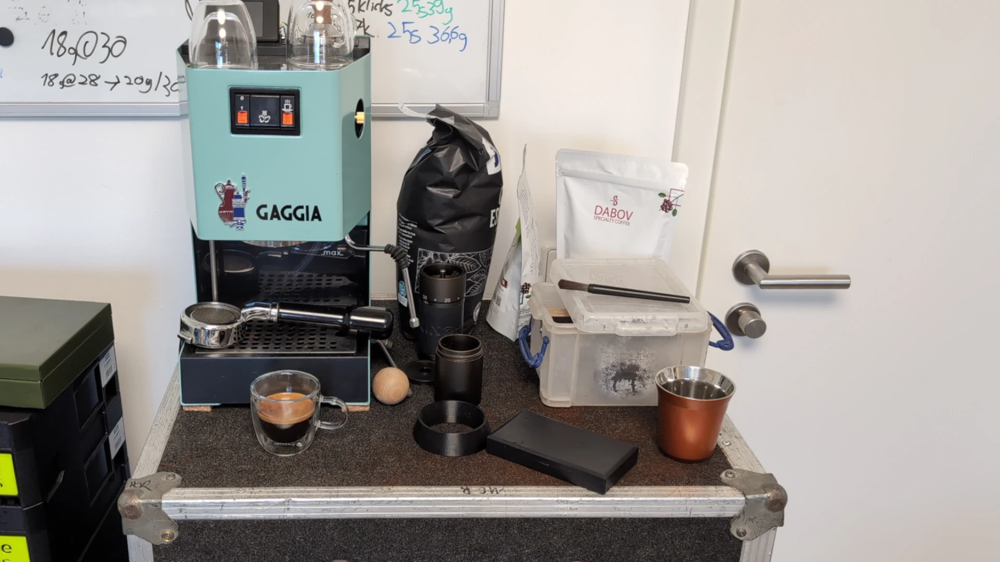

And the Gaggiuino in action...

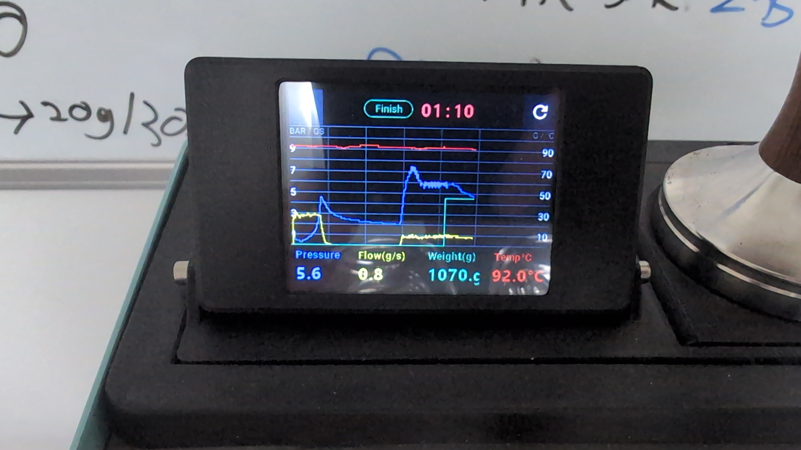

I still have some issues with the sensors, presumably interference from the AC power. I might need to add shielded sensor wires and/or shield the while micro-controller box.
