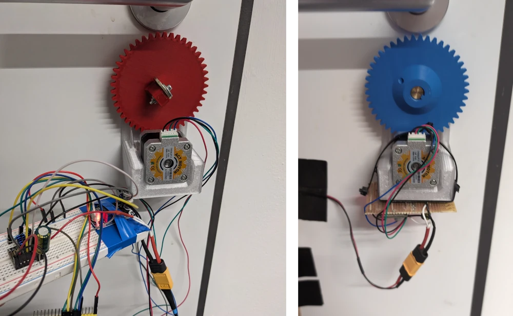
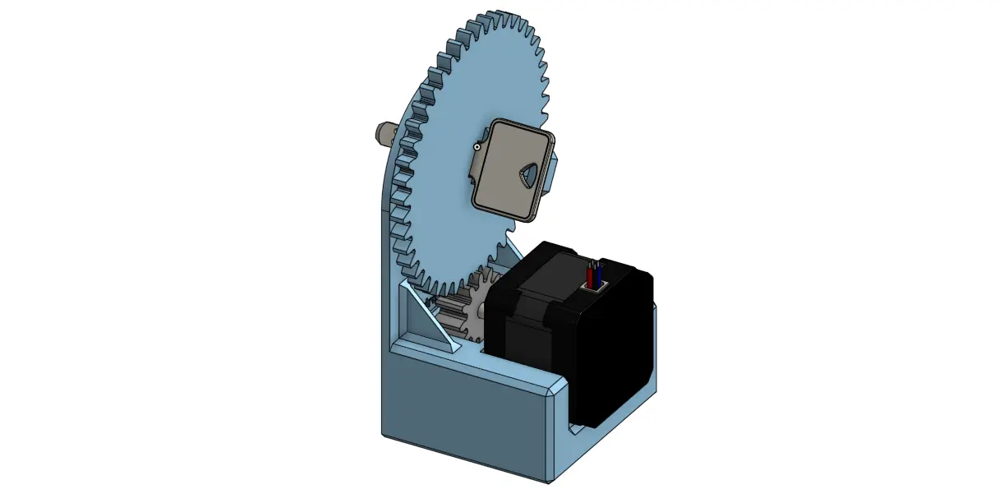
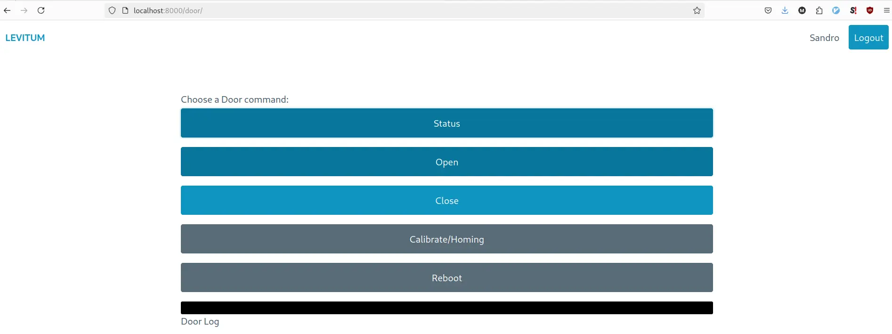

+++
title = 'Unlock a Door using OIDC'
date = 2024-09-28T21:36:18+02:00
tags = ['door', 'esp32', 'OIDC']
+++

## Necessity is the mother of invention

In parallel to my studies, I'm part of a non-profit student initiative trying to build a long range hydrogen powered eVTOL drone. Therefor we're provided some office space for prototyping and meeting. The only downside is that we don't have enough physical keys for the office's door lock, which highly limits the tinkering and prototyping flow. What if suddenly at 4am you had a brilliant idea on how to build a quick-release for the hydrogen cell from the fuselage and feel the urge to directly integrate and test it? Chances are meh (12.5%), since there are 5 keys distributed along ~40 people.

### Somebody must have solved this problem already...

Indeed! There are existing products on the market which get attached to a door from inside the room and (un-)lock it once instructed to do so by some (mobile) application. Once such product is the [Nuki Smart Lock (Pro)](https://nuki.io/de/compare-smart-lock/) which seems to do a decent job at this, the Pro version even comes with MQTT capability, which would allow us not to rely on some third-party service. With a price tag of 289€ it is certainly not cheap and since I didn't know how well it could manage an often changing user base of students, I decided to build my own.

## Design & Requirements

The recipe seems quite simple: attach a stepper motor to the key and rotate until the door is (un-)locked. I'm using stepper motors and drivers like the ones from 3D-Printers. The `tmc2209` stepper driver also has the advantage of being able to detect motor stalls; On 3D-Printers this is used for "sensorless homing". That's important since the key needs to be able to make more than two full rotations, thus it would be hard to find a spot where to mount an endstop.

An ESP32 is used to control the stepper driver via UART. The microcontroller represents the door as a state machine with states `[UNKNOWN, HOMING, OPEN, CLOSING, CLOSED, OPENING]` and offers a simple RPC interface via TCP Sockets. A raspberry pi in the same network is then used to host a website for user interaction, authentication, authorization and auditing.

The key feature here is the integration to Microsoft Entra via OIDC. Unfortunately we're using the Microsoft Suite at this student initiative... but with OIDC we can try to make the best out of it. I've added a `Security Group` in Microsoft Entra which gets placed as a claim in the OIDC flow. The django application on the raspberry pi can then provide the door interface to the user based on the claims.

When hacking together such a Smart Lock, it's important not to lock your self out (or even in!!). If for some reason, the ESP32 or stepper driver goes crazy, one should always be able to compete against the stepper motor with an original key from the other side of the lock. We've therefor replaced the existing lock cylinder with a Double cylinder lock "Doppelzylinderschloss", where you can independently operate the lock from either side.

Keep it simple and functional; This is what I went for, while maintaining a somewhat decent look. Before being redirected to the screen above, the typical OIDC flow is run, thanks to the amazing [Mozilla Django OIDC](https://github.com/mozilla/mozilla-django-oidc) library.

## Future Improvements 

Security is one thing that might need some more attention. The django application is accessible via https and the ODIC flow seems secure when set up correctly. But the communication between the raspberry pi and the ESP32 happens over bare metal TCP sockets. The security thereof is dependent on the security of the network and firewall. In the future one might wrap these sockets with TLS, maybe event add a certificate for client side authentication. For now, the smart door lock has served its purpose well and has been quite reliable.

## Project Links

[OpenDoor ESP32 Code](https://github.com/LEVITUM-e-V/opendoor)

[Office Django app](https://github.com/LEVITUM-e-V/office)
