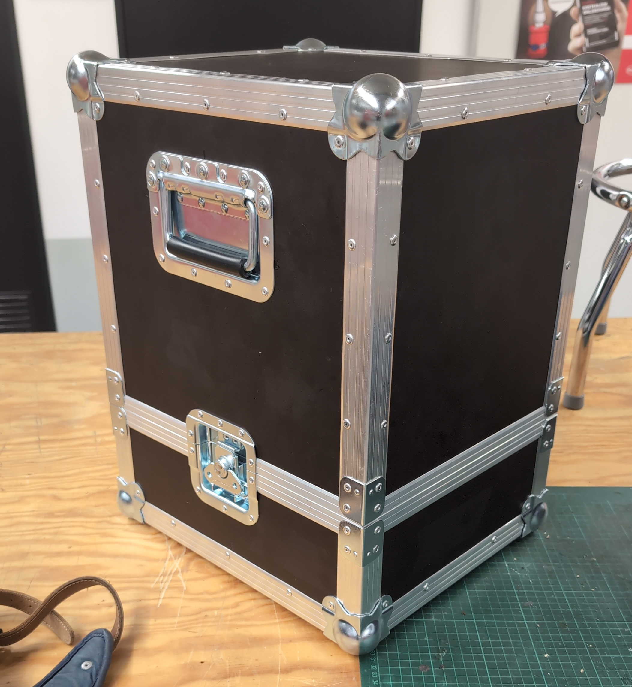
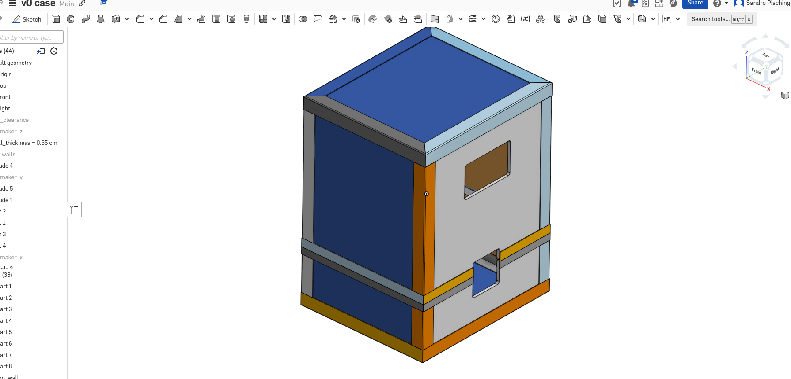
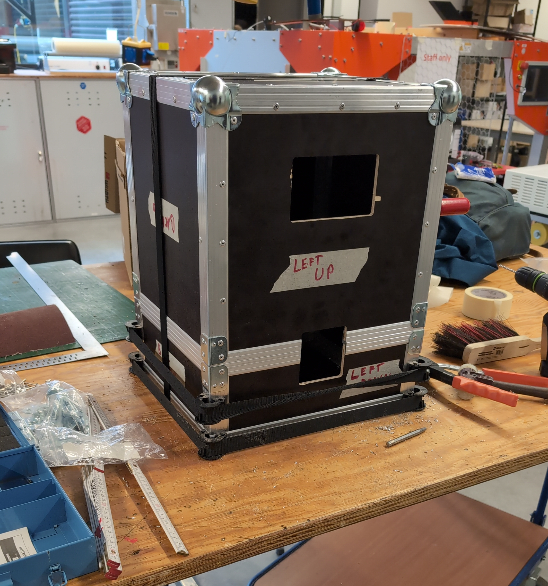

+++
title = 'Flightcase for Voron V0.2'
date = 2024-08-28T16:05:03+02:00
+++

Some time ago I decided to build a voron 3d-printer. The voron 3d-printers are designed by a great community with lots of experience and dedication. While their larger models are most popular, I decided to go with the smallest one - the V0 with a build volume of `120mm x 120mm x 120mm` for portability reasons.

When doing prototyping with friends or some hobby project I often wished to have my beloved voron v0.2 close by. Sadly it's too fragile for surving the transport with confidence; The countless hours invested in building and calibrating it might quickly go to waste if it takes damage while taking it outside my home lab. This is why it needed a strong and sturdy case to keep it safe for travels. A flightcase was needed.

# Designing

I started with the design and decided on a material and hardware. It ended up being `6mm` wodden plate and some flightcase aluminium casemaker extrusions. After designing the whole thing in CAD it was ready for production.

# BOM

| Qty | Description | Price |
| - | - | - |
6 m | AH6106-2M Adam Hall 6106 Aluminium Casemaker 30 mm Einschub 7 mm (Sperrgut) | 29,75€
4 m | AH6102-2M Adam Hall 6102 Aluminium Hybrid Schließprofil Einschub 7 mm (Sperrgut) | 7,56€
2 x | PE-H7150EZ Penn Elcom H7150 EZ Klappgriff mittel gefedert 8,5 mm tief | 7,23€
8 x | AH4043 Adam Hall 4043 L-Ecke 40 x 28 mm verzinkt | 1,88€
8 x | C1351Z Penn Elcom C1351Z Kugelecke mittel 50 mm dreischenklig gekröpft | 7,73€
75 x | BR04012-P1 Bralo Blindniete Standard 4,0 x 12,0 mm Alu/Stahl Einzeln | 3,53€
75 x | BR04008RIL-P1 Bralo Blindniete gerillt 4,0 x 8,0 mm Alu/Stahl Einzeln | 5,04€
2 x | PE-L0906 Penn Elcom L 0906 - Nietrahmen für mittlere Butterfly Verschlüsse | 3,03€
2 x | L907.915Z Penn Elcom L907/915Z Butterfly Verschluss mittel gekröpft 13 mm tief | 11,60€
1 x | MG8005-04 Penn Elcom POLYBloc Schaumstoff 5 mm schwarz 100 x 60 cm | 6,30€
1 x | MG8015-04 Penn Elcom POLYBloc Schaumstoff 15 mm schwarz 100 x 60 cm | 13,03€
1 x | NSZ30 30 mm Noppenschaumstoff anthrazit 100x50 cm | 4,96€
4 x | F1691 Penn Elcom F1691 - Gummifuß 25 x 25 mm mit Stahleinlage | 2,66€

# Manufacturing

Luckily I have access to a CNC-Machine with which I could cut out the wooden plates in a few minutes. The casemaker extrusions were cut using a horizontal bandsaw. In heinseight I should have used a cross-cut saw for a better finish.

I probably put too many rivots, but it doesn't hurt the rigidity so...

The foam was cut and glued to the inside of the box.
